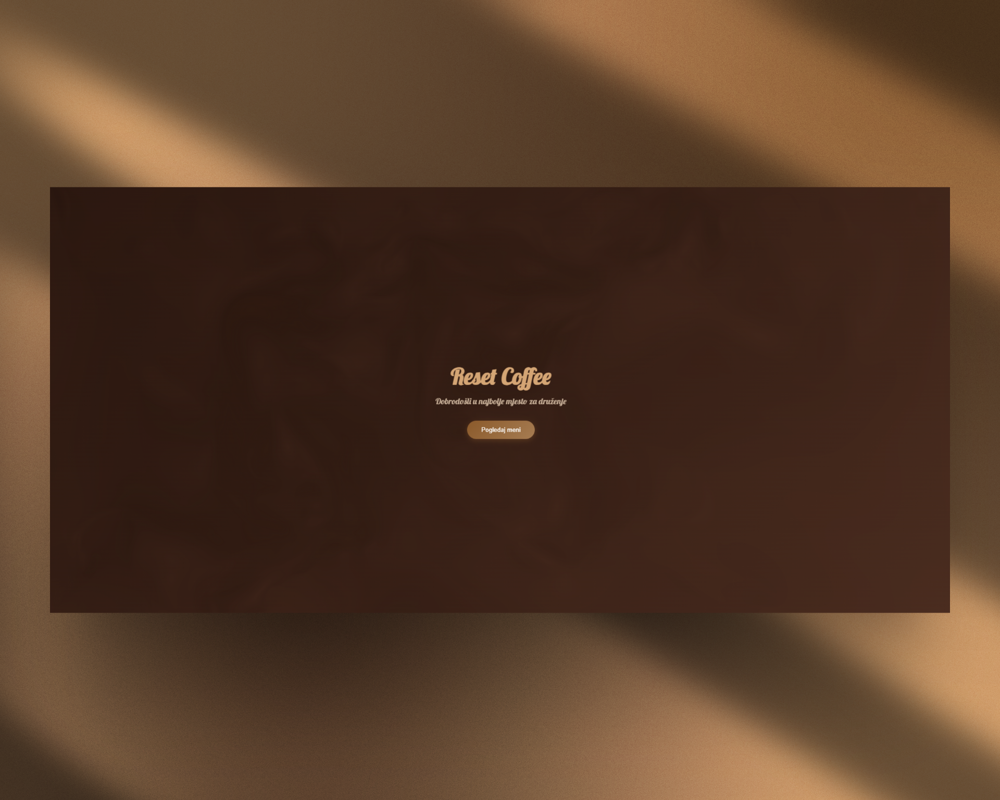

# Reset Coffee – QR Digital Menu

Reset Coffee is a modern web application built for cafés and bars that allows customers to view the menu by scanning a QR code. The menu opens directly in the browser, providing a fast, clean, and simple alternative to traditional physical menus.



## Features

- **QR Code Access** – Open menu instantly, no app needed  
- **Organized Menu** – Categories: Coffee, Tea, Pastries  
- **Mobile-First** – Optimized for smartphones and tablets  
- **Fast & Lightweight** – Built with React + Vite  
- **Clean UI** – Simple, intuitive interface  

## Live Demo & QR Code

The application is deployed and ready to use. Scan the QR code below with your phone's camera or click the link to view the live menu.


Scan this code to open the menu.

## Tech Stack

- **React** – Building the interactive user interface  
- **Vite** – Fast build tool and development server  
- **JavaScript (ES6+)** – Core programming language  
- **CSS** – Styling and responsive layout  

### Prerequisites

- Node.js (version 16 or higher recommended)
- npm (usually comes with Node.js)

### Installation

Clone the repository:
```bash
git clone https://github.com/IvanPavlovic-web/reset-qr.git
cd reset-qr
```
Install dependencies:
```bash
npm install
```
Start the development server:
```bash
npm run dev
```
Open your browser and navigate to http://localhost:5173

## Project Structure
```bash
reset-qr/
├── src/
│   ├── components/
│   │   ├── MenuCategory.jsx
│   │   ├── MenuItem.jsx
│   │   ├── Header.jsx
│   │   └── Footer.jsx
│   ├── data/
│   │   └── menuItems.js
│   ├── styles/
│   │   └── App.css
│   ├── App.jsx
│   └── main.jsx
├── public/
│   └── index.html
```
├── package.json
├── vite.config.js
└── README.md
```
